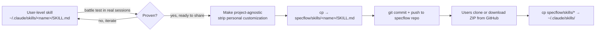

# SpecFlow

MCP server plugin for spec-driven development with a real-time web dashboard. Powers the spec workflow across all projects.

## Quick Reference

| Field             | Value                                                                                                                                                               |
| ----------------- | ------------------------------------------------------------------------------------------------------------------------------------------------------------------- |
| Package           | `@lbruton/specflow`                                                                                                                                                 |
| Version           | `3.6.3`                                                                                                                                                             |
| Upstream          | [Pimzino/spec-workflow-mcp](https://github.com/Pimzino/spec-workflow-mcp)                                                                                           |
| Origin            | [lbruton/specflow](https://github.com/lbruton/specflow)                                                                                                             |
| Branch            | `main` (PR required, signed commits, status checks)                                                                                                                 |
| Skills source     | `specflow/skills/` in the repo (users copy → `~/.claude/skills/`)                                                                                                   |
| Commands source   | `specflow/commands/` in the repo (users copy → `~/.claude/commands/`)                                                                                               |
| MCP install       | User-level `~/.claude/settings.json` → `npx -y @lbruton/specflow@latest .`                                                                                          |
| Dashboard port    | `5000` (default; override with `specflow --dashboard --port <n>`). lbruton's environment uses `--port 5051`.                                                        |
| Dashboard service | Single Node process (`specflow --dashboard`; singleton instance registered in `~/.specflow-mcp/activeSession.json`); all MCP servers share the one running instance |
| Issue prefix      | `SFLW` (renamed from `SWF` 2026-04-26 with the Plane migration)                                                                                                     |
| Issue tracker     | Plane (self-hosted) — `https://plane.lbruton.cc/lbruton/projects/72fd0b33-6719-47fa-92a5-97e9ba511f32/`. Pre-migration markdown archived at `DocVault/Archive/Issues-Pre-Plane/SpecFlow/`. |

## DocVault — Project Documentation

Technical documentation lives in **DocVault** at `/Volumes/DATA/GitHub/DocVault/Projects/SpecFlow/`. mem0 supplements with session context and past decisions. Read both before discussing architecture or planning changes.

Key pages: Start at `/Volumes/DATA/GitHub/DocVault/Projects/SpecFlow/_Index.md` and follow the index.

```
Read /Volumes/DATA/GitHub/DocVault/Projects/SpecFlow/Overview.md
```

When making changes that affect documented behavior, run `/vault-update` before pushing.

## Architecture & Distribution Model

**Two completely separate distribution channels — do not confuse them:**

| Channel                             | What ships                                   | How users get it                                                     | Where it lives in the repo                              |
| ----------------------------------- | -------------------------------------------- | -------------------------------------------------------------------- | ------------------------------------------------------- |
| **npm package** `@lbruton/specflow` | MCP server + dashboard (compiled TypeScript) | `npx -y @lbruton/specflow@latest .` in user-level settings.json      | `src/` → built into `dist/` → published to npm          |
| **GitHub repo direct download**     | Skills + slash commands (markdown files)     | Clone/zip the repo, copy `skills/` and `commands/` into `~/.claude/` | `specflow/skills/` and `specflow/commands/` (top-level) |

**Skills and commands ship as plain markdown separate from the npm package.** Users install them by copying. The MCP server and the skills are independent — installing one does not install the other. The README must instruct users to do both.

### Skill Distribution Pipeline



**Canonical locations (single source of truth — no duplicates):**

| Location                           | Purpose                                                                                |
| ---------------------------------- | -------------------------------------------------------------------------------------- |
| `~/.claude/skills/<name>/SKILL.md` | lbruton's daily-driver, where new skills are battle-tested first                       |
| `specflow/skills/<name>/SKILL.md`  | **The shipped copy.** This is what users download from GitHub.                         |
| `specflow/commands/<name>.md`      | Shipped slash-command definitions (same model — users copy into `~/.claude/commands/`) |

**Hard rules:**

- Orphan directories from pre-v3.6.0 (`plugin/`, `.claude-plugin/`, `~/.claude/plugins/marketplaces/`) — delete on sight, do not edit.
- **Keep the user-level skill and the repo copy as separate files.** They are intentionally separate so user-level can iterate without dirtying the shipped version. Use direct `cp` for promotion, not symlinks.
- Promotion uses manual `cp` after the user-level version has been tested. Long-term we may automate this, but today it's a deliberate human step.

### DocVault Architecture

All specflow artifacts live in DocVault. Each project has only `.specflow/config.json` locally.

```
DocVault/specflow/
  templates/                         # Global templates (bundled, always overwritten)
  {ProjectName}/
    steering/                        # product.md, tech.md, structure.md
    templates/                       # Project-level overrides ONLY (not copies of globals)
    specs/                           # All spec artifacts (requirements, design, tasks, logs)
    approvals/                       # Approval records
    archive/specs/                   # Archived specs
```

**Config:** `.specflow/config.json` in each project root points to DocVault:

```json
{ "project": "StakTrakr", "docvault": "../DocVault", "issue_prefix": "STAK" }
```

**Path resolution:** `PathUtils.getWorkflowRoot()` reads config.json and returns DocVault path. All callers resolve automatically.

**Key modules:** `config-loader.ts` (read/validate config), `migration.ts` (one-time copy from local .specflow/ to DocVault), `index-updater.ts` (\_Index.md lifecycle)

## Source Structure

```
src/
  tools/           # MCP tool definitions (spec-status, spec-list, approvals, etc.)
    index.ts       # Tool registry - registerTools() + handleToolCall()
  prompts/         # MCP prompt definitions (create-spec, implement-task, etc.)
    index.ts       # Prompt registry
  core/            # Shared logic (parser, task-parser, path-utils)
                   # config-loader.ts — read/validate .specflow/config.json
                   # migration.ts — one-time .specflow/ → DocVault copy
                   # index-updater.ts — _Index.md lifecycle management
  dashboard/       # Dashboard UI server (parser.ts + server.ts)
  types.ts         # Shared TypeScript types
  index.ts         # Server entry point
skills/            # Shipped skills — users copy to ~/.claude/skills/
  audit/           # On-demand project health check
  chat/            # Casual discovery mode (Phase 0)
  codacy-resolve/  # Triage + resolve Codacy findings
  discover/        # Structured brainstorm/research (Phase 1)
  issue/           # Vault-based issue CRUD
  migrate-skill/   # Skill migration checklist
  pr-cleanup/      # Post-merge branch/worktree cleanup
  prime/           # Universal session boot
  publish-templates/  # Template publish pipeline (canonical src/markdown/templates/)
  retro/           # End-of-session retrospective → mem0
  spec/            # Spec-driven development orchestrator
  start/           # Lightweight session reorientation
  wrap/            # End-of-session orchestrator (supports --handoff)
commands/          # Shipped slash-command definitions — users copy to ~/.claude/commands/
  audit.md, create-spec.md, create-steering-doc.md, implement-task.md,
  inject-spec-workflow-guide.md, inject-steering-guide.md, prime.md,
  refresh-tasks.md, spec.md, spec-status.md, wrap.md
```

## Steering Documents

Project-level guidance lives in `DocVault/specflow/{project}/steering/`:

- `product.md` — vision, target users, principles, success metrics
- `tech.md` — stack decisions, architecture rationale, known limitations
- `structure.md` — directory layout, naming conventions, module boundaries

Reference these when planning new features or making architectural decisions.

## Templates — Source of Truth Hierarchy

**`src/markdown/templates/{name}.md` is the ONE editable source.** Everything downstream is a derived artifact or runtime cache.

```text
src/markdown/templates/{name}.md           ← CANONICAL (edit here, or via /publish-templates)
   ├─→ dist/markdown/templates/            ← npm build output
   │     └─→ @lbruton/specflow on npm
   │           └─→ DocVault/specflow/{project}/templates/  ← runtime cache for bundled/global files
   └─→ DocVault/Projects/SpecFlow/Templates/{name}-guide.md  ← KB snapshot, regenerated by /publish-templates
```

| Directory                                              | Role                                           | Editable?                                                                                                                                                                                                                               |
| ------------------------------------------------------ | ---------------------------------------------- | --------------------------------------------------------------------------------------------------------------------------------------------------------------------------------------------------------------------------------------- |
| `src/markdown/templates/`                              | Canonical source in git                        | **YES** — edit directly or use `/publish-templates`                                                                                                                                                                                    |
| `DocVault/Projects/SpecFlow/Templates/{name}-guide.md` | Human-readable KB mirror (Obsidian)            | **Read-only** — auto-regenerated; hand-edits are overwritten                                                                                                                                                                            |
| `DocVault/specflow/{project}/templates/`               | Per-project runtime cache + additive overrides | **Global/bundled filenames: Read-only** — MCP boot re-copies them from the npm package (until SWF-95 version-gates this). **New override-only filenames: Editable** — not clobbered; StakTrakr is the only project with legitimate overrides today. |

**Ship a change:** use `/publish-templates` — writes canonical, regenerates the DocVault guide snapshot, builds/tests, bumps version, commits, pushes, and stops before `npm publish` for manual passkey.

**Inspect a template:** read `src/markdown/templates/{name}.md` directly; the DocVault guide is the human-readable explanation.

**Path disambiguation:** `DocVault/Projects/SpecFlow/Templates/` (KB snapshots, auto-regenerated by `/publish-templates`) is a completely different path from `DocVault/specflow/{project}/templates/` (npm runtime cache, overwritten on MCP boot). Stale KB snapshots self-heal on the next `/publish-templates` run — do not trigger regeneration manually. The two tiers resolve in order: project `DocVault/specflow/{project}/templates/` (additive overrides, not clobbered) → bundled global templates from the npm package (clobbered on MCP boot).

## Two Parsers - Keep in Sync

- `src/core/parser.ts` -- used by MCP tools (spec-status, spec-list, etc.)
- `src/dashboard/parser.ts` -- used by the dashboard UI server

When you change how specs are parsed, update both parsers to keep them synchronized. Add this as a check in your Post-Change Gate: after editing either parser, grep the other for the same function names to confirm parity.

## Build, Test, and Deploy

```bash
npm run build            # validate:i18n → clean → tsc → build:dashboard (Vite)
npm test                 # vitest unit suite (src/**/__tests__)
npm run test:e2e         # Playwright E2E (e2e/*.spec.ts) — batch-approvals, worktree isolation
npm run test:e2e:worktree # worktree-scoped E2E (separate config)
npm run validate:mdx     # MDX template validator (SWF-101/116)
npm run format           # prettier --write .
```

After building, MCP tools pick up the rebuilt `dist/` on next invocation (an `/mcp` reconnect is enough for MCP-side assets). The dashboard is a **long-running Node process** (started via `specflow --dashboard`) — to serve rebuilt dashboard assets, stop it (kill the PID recorded in `~/.specflow-mcp/activeSession.json`) and relaunch with `specflow --dashboard`.

## Local Dev Mode (SFLW-12)

For iterative development on the MCP server itself, switch all clients from the npm-published package to the local build. This cuts the edit→test cycle from ~5 minutes (publish round-trip) to ~15 seconds (build + reconnect).

**Config files that reference the specflow MCP:**

| Client | Config path | Local command |
|--------|-------------|---------------|
| Claude Code CLI | `~/.claude.json` → `mcpServers.specflow` | `node /Volumes/DATA/GitHub/specflow/dist/index.js .` |
| Claude Desktop | `~/Library/Application Support/Claude/claude_desktop_config.json` → `mcpServers.specflow` | `node /Volumes/DATA/GitHub/specflow/dist/index.js .` |
| OpenCode | `~/.config/opencode/opencode.json` → `mcp.specflow` | `node /Volumes/DATA/GitHub/specflow/dist/index.js` (no trailing `.`) |

**Dev loop:**
1. Edit source in `src/`
2. `npm run build`
3. `/mcp` reconnect (Claude Code) or restart client (Desktop/OpenCode)
4. Test immediately

**Switch back to npx (after `npm publish`):**
Restore each config's `command` to `npx` and `args` to `["-y", "@lbruton/specflow@latest", "."]`.

**Safety:** Timestamped backups are created as `<config-path>.bak.<YYYYMMDD_HHMMSS>` before switching. If a build fails and corrupts `dist/`, the MCP server won't start — rebuild or restore the npx entry.

## Post-Change Gate -- MANDATORY

After ANY source edit, follow these steps:

1. `npm run build` -- verify compilation succeeds. **When in local dev mode** (see above), building in main is expected — that's the point. **When shipping via PR**, build in the worktree, not main — `rimraf` wipes `dist/` before `tsc` runs, and a failed build in main corrupts the live MCP with no easy recovery.
2. `git status --short` -- verify your changes
3. Create a worktree branch, commit your changes there, and open a PR
4. Merge the PR once all status checks pass

Always commit source changes promptly. `dist/` is gitignored — if you build without committing, the next `git pull` silently reverts your work.

**Branch protection:** `main` enforces signed commits, required pull requests, and required status checks. All changes (including skills, templates, docs) go through a PR. See the security note in the user-level `CLAUDE.md` § Repo Boundaries for the post-INC-001 rationale.

## Publishing

**For template-only changes:** Use the `/publish-templates` skill. It automates the full pipeline including backup-before-edit and stops at the manual `npm publish` step.

**For code/MCP/dashboard changes:**

```bash
# 1. Edit package.json version
# 2. npm run build
# 3. npm test
# 4. git add package.json package-lock.json && git commit && git push
# 5. npm publish --access public   (PASSKEY AUTH — manual user step, Claude cannot run this)
# 6. Clear npx cache: find ~/.npm/_npx -path "*/specflow/package.json" -exec dirname {} \; | xargs rm -rf
# 7. Verify: npm view @lbruton/specflow version
```

**npm publish constraint:** lbruton uses passkey authentication for npm. Hand off step 5 (`npm publish --access public`) to the user and wait for confirmation before running step 6 verification. See mem0 `feedback_npm_publish_passkey.md` for the rationale.

## Promoting a Skill — User-Level → Shipped

The promotion flow is intentionally manual. After a skill has been battle-tested at `~/.claude/skills/<name>/SKILL.md`:

1. **Sanitize** — strip any lbruton-specific paths, personal preferences, or workspace assumptions. The shipped copy must work for any user on any project.
2. **Copy** — `cp ~/.claude/skills/<name>/SKILL.md /Volumes/DATA/GitHub/specflow/skills/<name>/SKILL.md` (create the subdirectory if it's a brand-new skill)
3. **Verify** — `diff ~/.claude/skills/<name>/SKILL.md specflow/skills/<name>/SKILL.md` — only the sanitization changes should appear; if anything else differs, you copied the wrong version
4. **Commit + push on a worktree branch, open a PR** — signed commits and required status checks are enforced on `main`, so there is no direct-push path even for docs/skills. Skills and commands ship through the same PR flow as source changes.
5. **Update README** if the skill is new — add it to the skills inventory section in the same PR

The same flow applies to slash commands in `commands/`. There is no build step, no compile, no npm involvement. Skills and commands ship as raw markdown.

**Reverse-sync (shipped → user-level):** When a PR sanitizes the shipped copy and makes it cleaner than the user-level version, reverse-sync immediately after merge:

1. `cp /Volumes/DATA/GitHub/specflow/skills/<name>/SKILL.md ~/.claude/skills/<name>/SKILL.md`
2. Re-personalize any `{owner}` → `lbruton` placeholders the sanitization introduced
3. Verify: `diff ~/.claude/skills/<name>/SKILL.md specflow/skills/<name>/SKILL.md` — only re-personalization changes should appear

**Best practices:**

- Test skills at user level first before editing `specflow/skills/<name>/SKILL.md` directly. This prevents shipping broken versions.
- Keep user-level and repo-copy as separate files so user-level can iterate freely. Use `cp` for promotion.
- After any sync in either direction, run `diff` to confirm only the expected delta landed.
- When you encounter a `plugin/` directory in search results, recognize it as an orphan and delete it rather than editing it.

## Gotcha: mem0 Reader Pattern (SWF-90)

mem0 cloud v1 API does not persist top-level `agent_id` — it's `null` on every record. Project tag lives in `metadata.project`. Filter mem0 reads by fetching unfiltered, then post-filtering on `metadata.project` case-insensitively (legacy records have inconsistent casing like `SpecFlow` vs `specflow`). Avoid filtering with `filters: {AND: [{agent_id: <tag>}]}` as it will not match. Canonical pattern: `~/.claude/hooks/mem0-session-start.py:83-140`. Full reference: `DocVault/Architecture/mem0-configuration.md` § Schema Reality.

## Adding a New Tool

1. Create `src/tools/my-tool.ts` -- export a `Tool` object + handler function
2. Register in `src/tools/index.ts` -- add to `registerTools()` array + `handleToolCall()` switch
3. `npm run build`

## Adding a New Prompt

1. Create `src/prompts/my-prompt.ts` -- export a `PromptDefinition`
2. Register in `src/prompts/index.ts`
3. `npm run build`

## DocVault Index Rule

Every DocVault folder must have `_Index.md`. When creating, deleting, or moving files in DocVault, update the folder's `_Index.md` and parent indexes in the same commit. Run `/vault-reconcile` to detect drift. When moving an issue to `Closed/`, update **both** the source `_Index.md` (remove entry) and `Closed/_Index.md` (add entry) atomically — partial updates create ghost entries.

## Post-Publish Verification -- MANDATORY

After `npm publish`, complete these verification steps before telling the user it's done:

1. Verify npm has the new version: `npm view @lbruton/specflow version`
2. Clear npx cache if stale (see Publishing section)
3. Run `/mcp` reconnect to load new version
4. *(Migration complete as of v3.5.0 — skip unless troubleshooting a fresh install)* Verify config loads: check that `DocVault/specflow/{project}/` dirs exist
5. *(Migration complete as of v3.5.0 — skip unless troubleshooting a fresh install)* Verify migration ran: local `.specflow/` should contain only `config.json`
6. *(Migration complete as of v3.5.0 — skip unless troubleshooting a fresh install)* Verify templates: project templates dir should have overrides only, not globals
7. Run a test spec or `spec-status` to confirm MCP tools work with DocVault paths

## Gotcha: Version Bump Checklist

When bumping `package.json` version, update these files as well:

1. `CLAUDE.md` Quick Reference table (Version field)
2. Run `npm run build` to propagate to `dist/`

The CLAUDE.md version field is not auto-synced — manual updates are required on every bump.

## Gotcha: Squash Merge Branch Cleanup

GitHub squash-merges PRs by default. After merge, `git branch -d <branch>` fails with "not fully merged" because the squash commit has a different SHA than the branch commits. The branch is merged — the `[gone]` tracking status confirms this. Use `git branch -D <branch>` (capital D) for branches confirmed `[gone]` after a squash merge.

## Gotcha: Prompt Path References

MCP prompts in `src/prompts/` embed file paths in their text output. Use `PathUtils.getWorkflowRoot()` for all paths — avoid hardcoding `.specflow/`. When you change path resolution, search all prompts for stale path strings. Files to check: create-spec.ts, implement-task.ts, spec-status.ts, create-steering-doc.ts, inject-steering-guide.ts.

## Quality Gates (OPS-143)

Pre-commit + build-time gates run automatically. Expect side effects on Edit/Write/commit.

- **prettier + lint-staged + husky**: staged `.{ts,tsx,js,cjs,mjs,json,css,html}` files get auto-formatted with `prettier --write` on every commit. Expect formatting changes on top of your own edits. Config: `.prettierrc.json`, `.prettierignore`.
- **i18n validation**: `npm run validate:i18n` runs as the first step of every `npm run build`. The build fails on missing/extra/misformatted translation keys. Script: `scripts/validate-i18n.js`.
- **MDX validation**: `npm run validate:mdx` (`scripts/validate-mdx.ts` → `src/core/mdx-validator.ts`) validates spec/template MDX. Use `PathUtils.getWorkflowRoot()` in all callers — hardcoded `.specflow/` paths break the validator.
- **CodeQL is NOT a required status check** — only `Codacy Static Code Analysis` is required per the `protect-main` ruleset. Verify with `gh api repos/lbruton/specflow/rulesets` before spending effort fixing a CodeQL failure. Large formatting diffs can surface pre-existing CodeQL annotations on unchanged lines — classify these as pre-existing, not PR-introduced.
- **OAuth token lacks `workflow` scope** — pushes touching `.github/workflows/` files will be rejected. `.github/` is in `.prettierignore` for this reason. File workflow changes as a separate issue rather than including them in formatting or tooling PRs.

## Hooks

- **gitleaks**: Pre-commit hook scans for accidental secret commits (`github-pat`, `aws`, `stripe`, etc.). Runs via `pre-commit` framework. Installed 2026-04-14 (OPS-116).
- **Husky + gitleaks coexistence**: Husky v9 sets `core.hooksPath=.husky`, taking over from `.git/hooks/` entirely. The gitleaks `pre-commit` framework writes to `.git/hooks/`, so the husky `pre-commit` script must explicitly call `pre-commit run` to chain gitleaks. Without this, gitleaks silently stops running after husky is installed.

## Consumers

This plugin is loaded by every project: StakTrakr, HexTrackr, Forge, MyMelo, WhoseOnFirst, Playground, claude-context, HomeNetwork, Portfolio (lbruton.github.io), obsidian-mcp, TechRefreshMacCompare. Changes here affect all of them. Test carefully.
