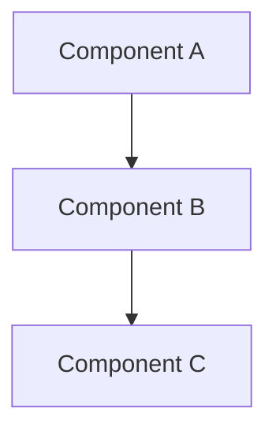

# Design Document

## References

- **Issue:** PROJ-XXX
- **GitHub PR:** [#NNN](https://github.com/owner/repo/pull/NNN)
- **Spec Path:** `specs/{spec-name}/` (under the resolved workflow root)

## Overview

[High-level description of the feature and its place in the overall system]

## Steering Document Alignment

### Technical Standards (tech.md)
[How the design follows documented technical patterns and standards]

### Project Structure (structure.md)
[How the implementation will follow project organization conventions]

## Code Reuse Analysis
[What existing code will be leveraged, extended, or integrated with this feature]

### Existing Components to Leverage
- **[Component/Utility Name]**: [How it will be used]
- **[Service/Helper Name]**: [How it will be extended]

### Integration Points
- **[Existing System/API]**: [How the new feature will integrate]
- **[Database/Storage]**: [How data will connect to existing schemas]

## Architecture

[Describe the overall architecture and design patterns used]

### Modular Design Principles
- **Single File Responsibility**: Each file should handle one specific concern or domain
- **Component Isolation**: Create small, focused components rather than large monolithic files
- **Service Layer Separation**: Separate data access, business logic, and presentation layers
- **Utility Modularity**: Break utilities into focused, single-purpose modules



## Components and Interfaces

### Component 1
- **Purpose:** [What this component does]
- **Interfaces:** [Public methods/APIs]
- **Dependencies:** [What it depends on]
- **Reuses:** [Existing components/utilities it builds upon]

### Component 2
- **Purpose:** [What this component does]
- **Interfaces:** [Public methods/APIs]
- **Dependencies:** [What it depends on]
- **Reuses:** [Existing components/utilities it builds upon]

## Data Models

### Model 1
```
[Define the structure of Model1 in your language]
- id: [unique identifier type]
- name: [string/text type]
- [Additional properties as needed]
```

### Model 2
```
[Define the structure of Model2 in your language]
- id: [unique identifier type]
- [Additional properties as needed]
```

## UI Impact Assessment

### Has UI Changes: [Yes / No]

_If **No**, skip this section entirely. If **Yes**, complete all fields below — this gates Phase 4._

### Visual Scope
- **Impact Level:** [New screen / New modal or panel / Redesign existing component / Minor element additions]
- **Components Affected:** [List every UI component this spec creates or modifies]
- **Prototype Required:** [Yes — if 3+ data elements, new layout, or uncertain visual hierarchy / No — single-element additions with clear analogues]

### Prototype Artifacts
- **Stitch Screen IDs:** [To be filled during prototype phase — leave blank in design doc]
- **Playground File:** [To be filled during prototype phase — leave blank in design doc]
- **Reference HTML/Mockup:** [Path to any existing prototype, mockup, or reference HTML provided with the spec]

### Design Constraints
- **Theme Compatibility:** [Must work in: light / dark / sepia / all]
- **Existing Patterns to Match:** [Name specific existing components whose visual style this should follow]
- **Responsive Behavior:** [How this renders on mobile / tablet / desktop]

### Visual Approval Gate
> **BLOCKING:** If `Prototype Required` is **Yes**, no UI implementation task may begin until:
> 1. A Stitch mockup or equivalent visual is created and reviewed
> 2. A Playground prototype (or reference HTML) is interactively approved by the user
> 3. Both artifact paths are filled in above
>
> This gate is enforced in Phase 4 — the orchestrator MUST check this section before dispatching any task tagged with `ui:true`.

## Open Questions

> **GATE:** All blocking questions must be resolved before this document can be approved.
> Questions carried from Requirements should be resolved here.

### Blocking (must resolve before approval)

- [ ] [Question — why it matters]

### Resolved

- [x] ~~[Question]~~ — [Answer, source]

## Error Handling

### Error Scenarios
1. **Scenario 1:** [Description]
   - **Handling:** [How to handle]
   - **User Impact:** [What user sees]

2. **Scenario 2:** [Description]
   - **Handling:** [How to handle]
   - **User Impact:** [What user sees]

## Security Considerations

> **GATE:** This section must be filled in for every spec, even if the answer is "no security impact." A spec that explicitly declares no security impact is fine; a spec that omits this section is not — it cannot be assessed by reviewers and will fail the readiness gate.

### Security Impact: [Yes / No / Minimal]

_If **No** or **Minimal**, briefly justify (e.g., "string rename with no input/auth/network changes"). If **Yes**, complete the fields below — these gate the Codacy SRM scan in tasks.md C5.5._

### Sensitive Data Touched
- **User input parsed/validated:** [list inputs that cross trust boundaries — form fields, query params, file uploads, API payloads]
- **Authentication/authorization changes:** [any change to who can access what — new roles, new permission checks, session/token handling]
- **Secrets or credentials handled:** [API keys, tokens, passwords, encryption keys — and where they're sourced from, e.g., Infisical]
- **PII or sensitive user data:** [any field that contains personal info, financial data, health data, location, etc.]

### Threat Surface Changes
- **New network endpoints:** [URLs/methods being exposed, with auth requirements]
- **New external dependencies:** [npm/pip packages being added — supply-chain risk]
- **New file system access:** [paths being read/written, especially user-controlled paths]
- **New shell commands or eval:** [any `exec`, `eval`, `Function()`, template strings used as commands — injection risk]
- **New deserialization of untrusted input:** [JSON/YAML/binary formats parsing untrusted bytes — deserialization vulnerabilities]

### Input Validation Strategy
- **Where validation happens:** [client / server / both]
- **What is validated:** [type, length, format, allow-list, deny-list]
- **Sanitization for storage/display:** [HTML escape, SQL parameterization, path normalization]

### Codacy SRM Pre-Check (advisory)
- **Run before tasks.md C5.5:** Check existing Codacy SRM findings against the files this spec will modify (use `mcp__codacy__codacy_search_repository_srm_items` filtered to changed files — this is the SRM/security tool family, NOT `codacy_list_repository_issues` which returns code-quality findings)
- **Findings to address up front:** [list any pre-existing Critical/High findings on files this spec touches, so they can be fixed in scope rather than orphaned]

### Codacy SRM Gate (enforced in tasks.md C5.5)
- The spec workflow's tasks.md template includes C5.5 Security Review which runs Codacy SRM against changed files post-implementation
- This design section captures the **intent and threat model**; C5.5 verifies the implementation
- For specs declaring `Security Impact: No`, C5.5 still runs but is expected to find zero new issues — any Critical/High finding becomes a hard gate

### Out-of-Scope Security Notes
[Anything related to security that this spec does NOT address but should be tracked separately — file as a follow-up issue rather than expanding this spec's scope]

## Testing Strategy

### Automated Tests
- **Test Framework:** [Identify the project's test framework — check for vitest.config, jest.config, pytest.ini, or package.json test script]
- **Test Command:** [The command to run the project's test suite — e.g., `npm test`, `npx vitest`, `pytest`]
- **Test Directory:** [Where tests live in this project — e.g., `src/__tests__/`, `tests/`, `test/`]
- **New tests to write (TDD — before implementation):** [describe tests using the project's framework]
- **Run via:** [project's test command] after implementation

### Manual Verification
- [Any flows that require manual testing beyond the automated test suite]
- [Flows requiring API keys, external services, or user interaction]
