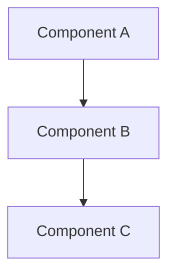

# Design Document

## References

- **Issue:** PROJ-XXX
- **GitHub PR:** [#NNN](https://github.com/owner/repo/pull/NNN)
- **Spec Path:** `.spec-workflow/specs/{spec-name}/`

## Overview

[High-level description of the feature and its place in the overall system]

## Steering Document Alignment

### Technical Standards (tech.md)
[How the design follows documented technical patterns and standards]

### Project Structure (structure.md)
[How the implementation will follow project organization conventions]

## Code Reuse Analysis
[What existing code will be leveraged, extended, or integrated with this feature]

### Existing Components to Leverage
- **[Component/Utility Name]**: [How it will be used]
- **[Service/Helper Name]**: [How it will be extended]

### Integration Points
- **[Existing System/API]**: [How the new feature will integrate]
- **[Database/Storage]**: [How data will connect to existing schemas]

## Architecture

[Describe the overall architecture and design patterns used]

### Modular Design Principles
- **Single File Responsibility**: Each file should handle one specific concern or domain
- **Component Isolation**: Create small, focused components rather than large monolithic files
- **Service Layer Separation**: Separate data access, business logic, and presentation layers
- **Utility Modularity**: Break utilities into focused, single-purpose modules



## Components and Interfaces

### Component 1
- **Purpose:** [What this component does]
- **Interfaces:** [Public methods/APIs]
- **Dependencies:** [What it depends on]
- **Reuses:** [Existing components/utilities it builds upon]

### Component 2
- **Purpose:** [What this component does]
- **Interfaces:** [Public methods/APIs]
- **Dependencies:** [What it depends on]
- **Reuses:** [Existing components/utilities it builds upon]

## Data Models

### Model 1
```
[Define the structure of Model1 in your language]
- id: [unique identifier type]
- name: [string/text type]
- [Additional properties as needed]
```

### Model 2
```
[Define the structure of Model2 in your language]
- id: [unique identifier type]
- [Additional properties as needed]
```

## UI Impact Assessment

### Has UI Changes: [Yes / No]

_If **No**, skip this section entirely. If **Yes**, complete all fields below — this gates Phase 4._

### Visual Scope
- **Impact Level:** [New screen / New modal or panel / Redesign existing component / Minor element additions]
- **Components Affected:** [List every UI component this spec creates or modifies]
- **Prototype Required:** [Yes — if 3+ data elements, new layout, or uncertain visual hierarchy / No — single-element additions with clear analogues]

### Prototype Artifacts
- **Stitch Screen IDs:** [To be filled during prototype phase — leave blank in design doc]
- **Playground File:** [To be filled during prototype phase — leave blank in design doc]
- **Reference HTML/Mockup:** [Path to any existing prototype, mockup, or reference HTML provided with the spec]

### Design Constraints
- **Theme Compatibility:** [Must work in: light / dark / sepia / all]
- **Existing Patterns to Match:** [Name specific existing components whose visual style this should follow]
- **Responsive Behavior:** [How this renders on mobile / tablet / desktop]

### Visual Approval Gate
> **BLOCKING:** If `Prototype Required` is **Yes**, no UI implementation task may begin until:
> 1. A Stitch mockup or equivalent visual is created and reviewed
> 2. A Playground prototype (or reference HTML) is interactively approved by the user
> 3. Both artifact paths are filled in above
>
> This gate is enforced in Phase 4 — the orchestrator MUST check this section before dispatching any task tagged with `ui:true`.

## Open Questions

> **GATE:** All blocking questions must be resolved before this document can be approved.
> Questions carried from Requirements should be resolved here.

### Blocking (must resolve before approval)

- [ ] [Question — why it matters]

### Resolved

- [x] ~~[Question]~~ — [Answer, source]

## Error Handling

### Error Scenarios
1. **Scenario 1:** [Description]
   - **Handling:** [How to handle]
   - **User Impact:** [What user sees]

2. **Scenario 2:** [Description]
   - **Handling:** [How to handle]
   - **User Impact:** [What user sees]

## Testing Strategy

### Runbook E2E Tests (Primary)
- Identify affected `tests/runbook/` section(s): [01-page-load, 02-crud, 03-backup-restore, 04-import-export, 05-market, 06-ui-ux, 07-activity-log, 08-spot-prices]
- New test blocks to write (TDD — before implementation): [describe tests]
- Run via `/bb-test sections=NN` against PR preview URL

### Manual Verification
- [Any flows that require manual testing, e.g., OAuth/Dropbox cloud sync at beta.staktrakr.com]
- [Flows requiring API keys from Infisical]
